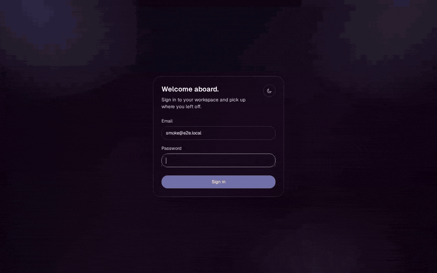
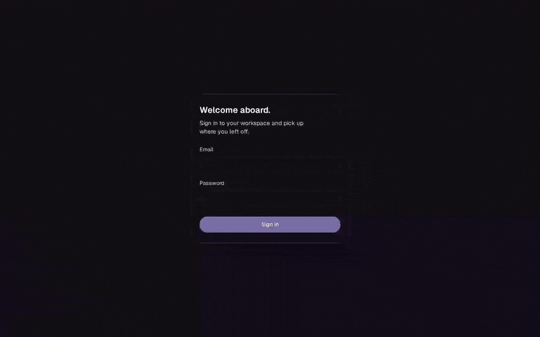
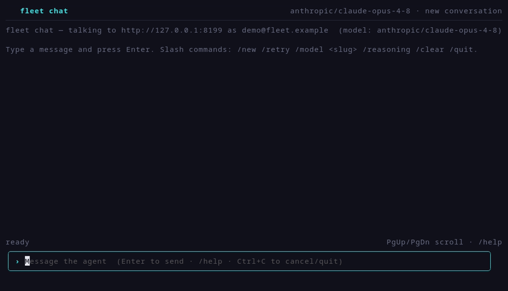

# fleet

[](https://github.com/ElcanoTek/fleet/actions/workflows/ci.yml)
[](LICENSE)

**A general-purpose agent fleet you run yourself — any model, in a
sandbox, on a budget, connected to your data.**

One open-source process on your own box: a governed agent runtime, a hardened
execution sandbox, a scheduler, and three clients — web chat, an Operations
Center, a terminal TUI. Every tool call is sandboxed, every turn is metered,
and credentials never leave the host.

## See it in action

One story, three surfaces: **plan the work in chat, automate the
follow-through, ride along from anywhere.** The web demos are real recordings —
real model, real sandbox, real scheduler
([how they're made](docs/generating-demo-gif.md)).

**Chat — plan the kickoff, live** _(real model + sandbox)_



**Operations Center — the follow-through, automated** _(real scheduler)_



**Terminal chat (`fleet chat`) — the same fleet, from your shell**



_(Static screenshots for all three surfaces still live under
[`docs/screenshots/`](docs/screenshots/), auto-regenerated by
[`.github/workflows/screenshots.yml`](.github/workflows/screenshots.yml).)_

> **Status:** early, active development. fleet is pre-1.0 — the architecture is
> in place and exercised by an extensive test suite (Go + web + live e2e), but
> APIs and config shapes can still change. Expect rough edges.

## Contents

- [See it in action](#see-it-in-action) · [Why fleet](#why-fleet) · [Batteries included](#batteries-included) · [Built for trust](#built-for-trust-governed-auditable-delegation) · [Architecture at a glance](#architecture-at-a-glance) · [Standards](#standards)
- [Repository layout](#repository-layout) · [The client-config bundle](#the-client-config-bundle) · [No lock-in](#no-lock-in-your-agent-ip-is-portable) · [Development](#development)
- [Deploy](#deploy) · [Operating fleet](#operating-fleet) · [Documentation](#documentation)
- [Built by Elcano](#built-by-elcano-commercial-support) · [Contributing](#contributing) · [License](#license)

## Why fleet

If your team keeps reaching for the same agent recipes — the same prompts, the
same connected tools, the same guardrails — fleet is the place to standardize
them.

- **Any model.** fleet runs its own native agent loop and lets you choose the
  **best model for each task** rather than hard-wiring one vendor.

- **Sandboxed by default.** Every tool call — bash, Python, file I/O, MCP —
  runs in an ephemeral rootless-Podman container with **no fast path around
  it**, and MCP credentials are injected host-side by an out-of-process broker,
  never entering the sandbox or the model's context.

- **Two isolation tiers, one config line.** Set `sandbox.runtime: kata` (or
  `libkrun`) and every tool call gets a **dedicated KVM microVM** — escape now
  takes a hypervisor CVE, not a container break-out; fail-closed preflight at
  boot. [`docs/SANDBOX-RUNTIMES.md`](docs/SANDBOX-RUNTIMES.md).

- **Cost-controlled.** Per-turn cost and token **ceilings**, an iteration cap,
  and a timeout — enforced, not advisory. A runaway loop costs a capped turn,
  not an open-ended invoice.

- **A real scheduler.** Priority queues with anti-starvation, opt-in retries
  with backoff for *transient* failures only (deterministic ones never retry),
  bounded log retention with optional encrypted archival, and per-key priority
  ceilings. Every knob and default:
  [`docs/FEATURE-NOTES.md`](docs/FEATURE-NOTES.md).

- **Connected to your data.** fleet speaks [MCP](#standards): a per-deployment
  connector catalog with multi-account credentials brokered host-side, per-task
  tool selection, and per-user hosted-MCP connections.

- **Your setups, packaged.** Personas, playbooks, skills, connectors, branding,
  and model defaults live in a versioned **client-config bundle** (see below) —
  standardize once, reuse everywhere.

- **MIT-licensed and observable.** Structured observer events for every turn —
  each tool call, result, token count, and cost — so you always know what an
  agent did and what it cost.

## Batteries included

fleet ships usable on day one — the platform pieces you'd otherwise assemble
yourself are already in the box, tested, and governed by the same core:

- **An MCP connector library, two trust classes deep.** Your bundle's own
  connectors run **in the sandbox with credentials brokered host-side**, and a
  curated directory of **65 verified official vendor-hosted MCP servers**
  (GitHub, Google, Notion, Slack, Stripe, X, OpenRouter, Hugging Face, AWS, …)
  is one OAuth click away — each explicitly badged *Bundled* vs *Third-party*
  so users know what they're opting into ([`docs/MCP-CATALOG.md`](docs/MCP-CATALOG.md)).
  Inline `http_tools` cover the "just call this REST endpoint" cases without an
  MCP subprocess.
- **A real scheduler, not a cron wrapper.** Priority queues with
  anti-starvation, transient-only retries with backoff, SLA tracking, dead-letter
  + replay, per-task sandbox limits, structured JSON output (`output_schema`),
  live SSE run streams, batch/import/export, and an Upcoming-runs view.
- **Automation surface for your own ecosystem.** Typed API keys + an
  OpenAPI-specified HTTP API to enqueue and consume governed agent jobs from CI,
  cron, bots, or other tasks ([`docs/BUILDING-ON-FLEET.md`](docs/BUILDING-ON-FLEET.md));
  inbound HMAC webhooks and email triggers to spawn work; outbound
  signed-webhook/email/browser-push notifications when it finishes.
- **Memory that can be trusted.** Typed, provenanced user memory with
  approval-gated writes, pin/retire lifecycle, human-confirmed supersession,
  and a derived temporal knowledge graph with as-of queries
  ([`docs/MEMORY.md`](docs/MEMORY.md)).
- **Team surfaces.** Projects/spaces with shared instructions + curated
  connectors + shared memory, team RBAC, read-only share links, conversation
  branching, folders/labels, and a dataset/table agent for row-by-row
  background work with human-approved write-backs.
- **Quality gates for your agents.** A self-hosted eval & regression harness
  (`fleet eval`) that replays golden prompts through the real loop and gates
  model/bundle changes ([`docs/EVALS.md`](docs/EVALS.md)); per-run error
  analysis; optional PII redaction; a governed in-sandbox browser tool.
- **Three clients out of the box.** The web chat UI, the Operations Center,
  and a full terminal client (`fleet chat`) — all thin views over the same
  governed API.

## Built for trust: governed, auditable delegation

Delegating real work to an agent raises three concerns: can it do the job, can
you trust it with this task, and are you comfortable handing over control. fleet
answers each with a concrete mechanism, organized below.

**Can it do the job — reproducibly?** The whole agent setup — prompts,
personas, playbooks, skills, connectors, model defaults — is a **versioned
bundle** (a plain git repo), so the setup that worked runs again next time, for
the next person, on a schedule. Every turn streams structured **observer
events** (each tool call, result, tokens, cost), so you judge work from its
trace, not just its final answer.

**Should I trust it with this task?** Limits that actually fire — cost ceiling,
token ceiling, iteration cap, timeout — and a persisted per-turn audit trail.
fleet owns execution end to end: there is no self-executing agent it can only
observe, so the log records what actually ran.

**Am I comfortable handing over control?** The agent has no direct power: every
tool call goes through the sandbox under host policy (optionally a KVM microVM),
credentials stay host-side in the broker, sensitive actions raise a
**default-deny allow/deny card** with no "approve all", and unattended scheduled
work is fail-closed — network-sealed by default with an end-of-run verifier
([`docs/AGENT-RUNTIME.md`](docs/AGENT-RUNTIME.md)). One caveat to respect: the
bundle's own host-side MCP servers *do* receive brokered credentials by design,
so treat bundle write access as production access
([`SECURITY.md`](SECURITY.md)).

## Architecture at a glance

A single `fleet` process runs, on one box:

1. **Interactive real-time chat** sessions (streamed over SSE), and
2. A **scheduling engine** that runs recurring background agent tasks,

both executing their tool calls inside the **same** rootless-Podman sandbox, and
both driven by **one** unified agent runtime (`internal/agentcore`).

## Standards

fleet is built on open protocols. We list only what is actually implemented and
tested in this repository:

- **MCP — Model Context Protocol.** A merged Go client (stdio + HTTP) drives the
  deployment's connector catalog, and each **user** can OAuth into hosted MCP
  servers from the GUI (OAuth 2.1 + PKCE, dynamic registration, tokens encrypted
  at rest, host-side). [ADR-0009](docs/adr/0009-per-user-remote-mcp-oauth.md).
- **Agent Skills.** The bundle's `skills/` dir holds capabilities in the open
  [Agent Skills format](https://github.com/anthropics/skills), loaded with
  progressive disclosure (name + description in the prompt; the agent reads
  `SKILL.md` and runs bundled scripts on demand, in the sandbox). Invoke
  explicitly with `/skill-name` in chat.

The orchestrator HTTP API is published as an OpenAPI 3.1 contract at
[`docs/openapi.yaml`](docs/openapi.yaml); a CI test
(`cmd/fleet/openapi_drift_test.go`) keeps its routes + auth schemes in lockstep
with the shipped router (it does not gate body schemas).

## Repository layout

```
cmd/
  fleet/          the one unified binary — server (`fleet serve`: chat HTTP/SSE + orchestrator HTTP + scheduler + worker pool) AND operator CLI (every other verb)
  fleet-admin/    transitional deprecation shim — forwards to `fleet`; removed after one release
  cutlass/        DEPRECATED shim → `fleet task run` (removed after one release)
  sandbox-probe/  deploy-time sandbox smoke test
internal/
  agentcore/      the one unified run loop + shared agent primitives (cost ceilings, policy)
  agent/          input sources, observers, policies, finalize (interactive + scheduled)
  runner/         in-process capped worker pool (the old "gig", folded in)
  creds/          MCP credential-account store (host-side credential broker)
  clientconfig/   loads the pluggable CLIENT BUNDLE (branding, MCP catalog, prompts, skills, ...)
  mcp/            merged Go MCP client (stdio + HTTP)
  mcpbroker/      out-of-process MCP credential broker (keeps connector secrets out of the loop's address space)
  sandbox/        the single execution backend (ephemeral container over a persistent workspace)
  tools/          native agent tools (bash, python, ...)
  store/          interactive (chat) Postgres layer + migrations
  sched/          orchestrator/scheduler (was moc) + its migrations
  httpapi/        chat HTTP/SSE/auth layer
  config/         unified configuration (env loading; the MCP catalog comes from the bundle)
web/              one Next.js app: /chat and /orchestrator
config/default/   the GENERIC client bundle baked into the repo (runs bare),
                  including config/default/sandbox/Containerfile — the sandbox
                  image is a per-client bundle artifact (build-on-box default)
docs/             architecture & operator docs; docs/adr/ records the load-bearing
                  Architecture Decision Records behind the invariants
```

## The client-config bundle

fleet ships **no** client-specific content. It loads a **client-config bundle**
from `FLEET_CLIENT_CONFIG_DIR`: `manifest.yaml` supplies branding, model
defaults, the connector catalog, and tool policy; `system_prompts/`,
`personas/`, `protocols/`, `skills/`, and `mcp/` supply the content. Contract:
[`config/default/README.md`](config/default/README.md).

Three ways in: **run bare** (the in-repo generic bundle — good for a first
look), **fork the public template**
([`ElcanoTek/example-config`](https://github.com/ElcanoTek/example-config)), or
**point at your own private repo** (the box needs a read-only fine-grained PAT
to clone it). `bootstrap --client-config <git-url[#sha-or-tag]|path>` sets it
up; **pin the ref in production** — the bundle runs host-side under the service
identity ([`SECURITY.md`](SECURITY.md)), so a bundle change should be a
deliberate operator action, not a silent pull.

## No lock-in: your agent IP is portable

Everything that defines how your agents behave lives in the **client-config
bundle** — a plain git repo or directory you own (`FLEET_CLIENT_CONFIG_DIR`), not
inside fleet's database or binary:

- **`system_prompts/`** — base prompts for chat and tasks
- **`personas/`** — reusable agent profiles
- **`protocols/`** — playbooks your agents follow
- **`skills/`** — packaged [Agent Skills](#standards) (`SKILL.md` + bundled scripts)
- **`mcp/`** — your MCP connectors (+ `requirements.txt`)
- **`manifest.yaml`** — MCP catalog, tool policy, model defaults, sandbox block
- **`sandbox/Containerfile`** — the exact image your tool calls run in

Versioned files you control, over an open protocol ([MCP](#standards)): your
agent setup travels with you — fork it per team, share it across orgs, or point
it at another MCP-capable platform. Moving off fleet doesn't mean starting
over, which keeps adoption low-risk. The public template
([`ElcanoTek/example-config`](https://github.com/ElcanoTek/example-config))
shows the full layout.

## Development

```
make build      # go build ./...
make test       # go test ./...
make lint       # golangci-lint run
```

For the full build/test workflow (including the Postgres-backed Go suites, the
web app, and the Playwright e2e suites), see
[`CONTRIBUTING.md`](CONTRIBUTING.md).

### Running one task locally (`fleet task run`)

`fleet task run` executes a **single task YAML** to completion locally — no
server, no database — through the **same governed runtime** the production
scheduler uses (sandbox and credential brokering included). A debug
entrypoint, not a second execution path. _(Formerly the separate `cutlass`
binary; that name still forwards for one deprecation release.)_

```
fleet task run --log out.json path/to/task.yaml               # run one task through the governed runtime
scripts/run_workflow_live.sh docs/examples/local-task.yaml    # or: build the sandbox image, isolate a workspace, tail a log
```

See [`docs/examples/local-task.yaml`](docs/examples/local-task.yaml) for the
task schema (a thin mirror of the scheduled-task create shape).

## Deploy

fleet runs as **one** `fleet` process on a **single, vertically-scaled host**: the
browser talks only to the Next.js web app, which proxies server-side over
loopback to the two Go backends the process boots (chat + orchestrator); Caddy
fronts it with TLS. Single-host is by design — crash recovery uses single-owner
DB leases and the worker cap is a per-process semaphore, so fleet scales by
moving to a bigger box, not more replicas.

```sh
git clone https://github.com/ElcanoTek/fleet.git /opt/fleet/src
sudo bash /opt/fleet/src/scripts/bootstrap.sh --postgres=local --enable-service \
  --client-config https://github.com/ElcanoTek/example-config.git
# then add your OPENROUTER_API_KEY to the env file and: fleet restart
```

**→ Full deployment guide** — host sizing, the one-command web + Caddy/TLS stack,
the env file, and every option: **[`docs/DEPLOYMENT.md`](docs/DEPLOYMENT.md)**.

## Operating fleet

The operator lifecycle is **bootstrap → update → status**, one box. The server
runs via `fleet serve`; every other verb is the idempotent operator CLI (each a
`scripts/` shell script wrapped by a `fleet` subcommand). Each service
self-migrates on start.

| Verb | What it does |
|---|---|
| `fleet bootstrap` | provision a box (Postgres, build, install, systemd, optional web + TLS) |
| `fleet update` | `git pull` + rebuild + reinstall the binaries in place |
| `fleet upgrade` | drain, swap, health-gate, and auto-roll-back on failure |
| `fleet status` / `fleet diagnose` | health doctor / redacted support bundle |
| `fleet restart` · `stop` · `logs` | service lifecycle |
| `fleet chat [--email you@org]` | terminal TUI for the agent (token auto-read on-box) |
| `fleet backup` / `fleet restore` | disaster recovery ([`docs/BACKUP_RESTORE.md`](docs/BACKUP_RESTORE.md)) |

**→ Full operator runbook** — the env file, the client-config checkout, every
verb in detail, process logs, and backup/restore:
**[`docs/OPERATORS.md`](docs/OPERATORS.md)**.

## Documentation

Deep references live in [`docs/`](docs/) so this README stays an orientation, not a manual:

| Doc | What it covers |
|---|---|
| [`docs/DEPLOYMENT.md`](docs/DEPLOYMENT.md) | Full deployment guide — host sizing, the one-command web + Caddy/TLS stack, options |
| [`docs/OPERATORS.md`](docs/OPERATORS.md) | Operator runbook — the env file, the client-config checkout, every lifecycle verb |
| [`docs/AGENT-RUNTIME.md`](docs/AGENT-RUNTIME.md) | Agent runtime mechanics — per-turn sandbox, ceilings, compaction, verifier, artifacts |
| [`docs/SANDBOX-RUNTIMES.md`](docs/SANDBOX-RUNTIMES.md) | Sandbox OCI runtimes — `runc` / Kata / libkrun isolation tiers |
| [`docs/CONFIG-RELOAD.md`](docs/CONFIG-RELOAD.md) | Which settings hot-reload without a restart, and how |
| [`docs/BACKUP_RESTORE.md`](docs/BACKUP_RESTORE.md) | Disaster recovery — backup + restore of both databases |
| [`docs/WEBHOOK-SIGNING.md`](docs/WEBHOOK-SIGNING.md) · [`docs/TESTING.md`](docs/TESTING.md) | Webhook HMAC signing · the test suite + fake-LLM seam |
| [`docs/BUILDING-ON-FLEET.md`](docs/BUILDING-ON-FLEET.md) | The HTTP API as an automation substrate — keys, kicking off jobs, consuming structured output |
| [`docs/MCP-CATALOG.md`](docs/MCP-CATALOG.md) | The connector catalog — bundled vs third-party trust classes |
| [`docs/adr/`](docs/adr/) | Architecture Decision Records — the *why* behind the non-negotiable invariants |
| [`SECURITY.md`](SECURITY.md) · [`CONTRIBUTING.md`](CONTRIBUTING.md) | Reporting a vulnerability · contributor workflow + CI gates |

## Built by Elcano (commercial support)

fleet is built by **ElcanoTek**. The platform is MIT-licensed and yours to run;
the same team takes on **commercial engagements** — custom agents tuned to your
domain, fleets deployed and operated on your infrastructure, and bespoke MCP
connectors into the systems your work lives in. When you'd rather have the
people who wrote it design the connectors, protocols, and ceilings with you:
[elcanotek.com](https://elcanotek.com) ·
[brad@elcanotek.com](mailto:brad@elcanotek.com).

## Contributing

Contributions are welcome — see [`CONTRIBUTING.md`](CONTRIBUTING.md) for the
build/test workflow, branch/PR conventions, and CI gates. Please also read the
[`CODE_OF_CONDUCT.md`](CODE_OF_CONDUCT.md). To report a security issue privately,
see [`SECURITY.md`](SECURITY.md).

## Acknowledgements

fleet stands on the shoulders of excellent open-source projects and open
standards. Our thanks to the teams and communities behind them:

- **[Podman](https://github.com/containers/podman)** — rootless, daemonless
  containers. Every agent tool call (`bash`, `run_python`, MCP) executes inside a
  rootless-Podman sandbox; there is no trusted fast path that skips it.
- **[Kata Containers](https://katacontainers.io)** and
  **[libkrun](https://github.com/containers/libkrun)** — the OCI runtimes behind
  fleet's optional hypervisor-isolation tier: set `sandbox.runtime` and
  every tool call runs in a dedicated KVM microVM with its own guest kernel,
  plugging into the same Podman invocation unchanged.
- **[Fedora](https://fedoraproject.org)** — `fedora-minimal` is the base image
  for the default sandbox, and we think it's the safest base in the game for
  this job: a deliberately small image (less surface to attack), backed by one
  of the fastest CVE-response pipelines in any distribution, with the entire
  Python data stack installed as **signed Fedora RPMs** instead of `pip` at
  runtime — one audited supply chain, not a thousand PyPI tarballs. fleet
  deliberately tracks the rolling tag so every on-box rebuild picks up the
  current patches, and per-PR + weekly Grype scans keep the claim honest.
- **[Model Context Protocol](https://modelcontextprotocol.io)** and its SDKs —
  the open standard fleet speaks (stdio + HTTP) to reach tools and data through a
  credential-brokered MCP catalog.
- **[Agent Skills](https://github.com/anthropics/skills)** — the open skill
  format fleet loads from the client-config bundle (`SKILL.md` + bundled scripts,
  with progressive disclosure).
- **[Charmbracelet](https://github.com/charmbracelet)** — fleet leans on the
  charm stack end to end: **[Fantasy](https://github.com/charmbracelet/fantasy)**
  is the Go framework underneath the multi-provider agent run loop, and the
  `fleet chat` terminal client is built on
  **[Bubble Tea](https://github.com/charmbracelet/bubbletea)**,
  **[Bubbles](https://github.com/charmbracelet/bubbles)**,
  **[Lip Gloss](https://github.com/charmbracelet/lipgloss)**, and
  **[Glamour](https://github.com/charmbracelet/glamour)** — with
  **[vhs](https://github.com/charmbracelet/vhs)** recording the README's TUI
  demo and **[freeze](https://github.com/charmbracelet/freeze)** rendering its
  static screenshots.
- **[OpenRouter](https://openrouter.ai)** — unified, provider-agnostic model
  routing that backs fleet's "any model, the right one per task" design.

## License

fleet is released under the [MIT License](LICENSE).
