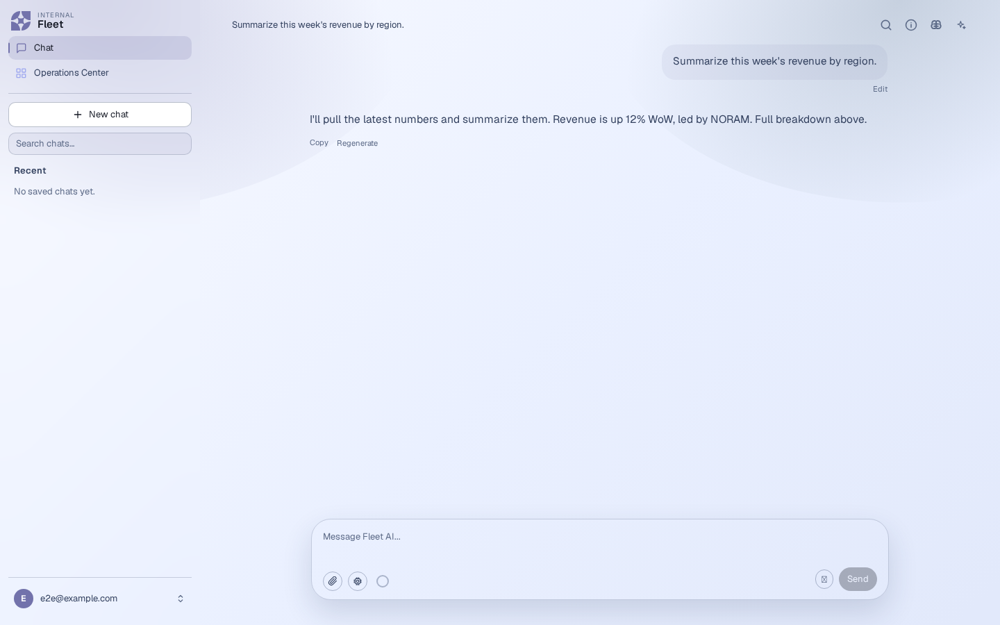
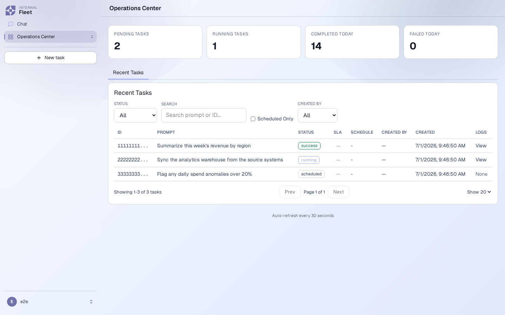

# fleet

[](https://github.com/ElcanoTek/fleet/actions/workflows/ci.yml)
[](LICENSE)

**A general-purpose agent fleet you run yourself — any model, in a
sandbox, on a budget, connected to your data.**

fleet is an open-source platform for running AI agents — both one-shot scheduled
tasks and interactive real-time chat — on infrastructure you control. One
`fleet` process boots a unified agent runtime, an execution sandbox, a
scheduler, and a worker pool, and serves both a chat UI and an orchestrator UI.
Every tool call an agent makes runs inside a rootless-Podman sandbox — with an
optional hypervisor tier that runs each call in a dedicated KVM microVM (Kata
Containers or libkrun); every turn is metered against a cost ceiling; and the
tools and data an agent can reach are brokered host-side so credentials never
enter the sandbox.

If your team keeps reaching for the same agent recipes — the same prompts, the
same connected tools, the same guardrails — fleet is the place to standardize
them.

> **Status:** early, active development. fleet is pre-1.0 — the architecture is
> in place and exercised by an extensive test suite (Go + web + live e2e), but
> APIs and config shapes can still change. Expect rough edges.

## Contents

- [Why fleet](#why-fleet) · [Batteries included](#batteries-included) · [Built for trust](#built-for-trust-governed-auditable-delegation) · [Architecture at a glance](#architecture-at-a-glance) · [Standards](#standards)
- [Repository layout](#repository-layout) · [The client-config bundle](#the-client-config-bundle) · [No lock-in](#no-lock-in-your-agent-ip-is-portable) · [Development](#development)
- [Deploy](#deploy) · [Operating fleet](#operating-fleet) · [Documentation](#documentation)
- [Built by Elcano](#built-by-elcano-commercial-support) · [Contributing](#contributing) · [License](#license)

## Screenshots

fleet serves one Next.js app with two surfaces — a **chat** UI for interactive
work and an **Operations Center** for scheduled tasks — plus a **terminal chat**
(`fleet chat`) for working from the shell. All route every tool call through the
same governed sandbox. _(Auto-regenerated on each push to `main` by
[`.github/workflows/screenshots.yml`](.github/workflows/screenshots.yml).)_

**Chat**



**Operations Center**



**Terminal chat (`fleet chat`)**


_(The demo is a scripted recording against a mock server — no model, no keys, fully
reproducible: [`docs/generating-demo-gif.md`](docs/generating-demo-gif.md).)_

## Why fleet

- **Any model.** fleet runs its own native agent loop and lets you choose the
  **best model for each task** rather than hard-wiring one vendor.

- **Sandboxed by default.** The agent loop runs in the fleet process, but every
  tool call — bash, Python, file I/O, MCP — executes inside an ephemeral,
  rootless-Podman container over a persistent per-conversation workspace. There
  is **no fast path that skips the tool sandbox**. MCP credentials never enter
  the sandbox: they are isolated by the **out-of-process MCP broker**, which
  injects them only when it runs a delegated MCP call host-side (issue #167).

- **Choose your isolation posture.** By default that sandbox uses the
  shared-kernel OCI runtime (`runc`/`crun`) — namespaces, cgroups, and seccomp.
  For untrusted prompts or sensitive data, raise it to a **dedicated KVM microVM
  per tool call** by setting the sandbox runtime to `kata` or `libkrun`: an
  escape then requires a *hypervisor* CVE, not just a container break-out. fleet
  fail-closed-preflights `/dev/kvm` and the runtime binary at boot (a missing
  KVM aborts startup rather than silently degrading), and every other guarantee
  — host-side credentials, network sealing, per-task limits — is unchanged. See
  [`docs/SANDBOX-RUNTIMES.md`](docs/SANDBOX-RUNTIMES.md).

- **Cost-controlled.** Each turn runs against configurable per-task cost and
  token **ceilings**, with usage and cost accounting tracked as the agent works.
  A model that won't stop calling tools is bounded by the ceiling, the
  per-turn timeout, and an iteration cap — not by your invoice.

- **Resilient scheduling.** A scheduled task that fails on a *transient* infra
  blip can be re-queued with exponential backoff up to its `max_retries`
  (default 0 = off, opt-in per task); a deterministic failure is never retried.
  An optional per-task `retry_policy` tunes the backoff (exponential or fixed,
  custom initial/max delay) and which failure classes retry (e.g. allow
  `context_budget`, block `cost_ceiling`); unset = the default transient-only
  curve. Retries are bounded and the agent is told its attempt number so it can
  avoid repeating non-idempotent side-effects — fleet does not auto-dedupe those.
  A daily retention sweep prunes terminal task runs (and their JSONB logs) older
  than `FLEET_RUN_LOG_RETENTION_DAYS` (default **90**) so the scheduler DB can't
  grow without bound, while always keeping the most recent
  `FLEET_KEEP_RUNS_PER_TASK` (default **10**) runs of each task regardless of age
  (so a task's last-known state is never lost). Set the retention to `0` to
  disable pruning; the sweep runs at `FLEET_CLEANUP_HOUR` UTC (default 04:00).
  As a middle path that keeps the audit trail, an **optional** archival sweep
  (off by default) gzip-compresses the log payloads of terminal tasks older than
  `FLEET_LOG_ARCHIVE_AFTER_DAYS` **in place** in the scheduler DB — reads inflate
  them transparently, so retrieval is unchanged. Set a base64 32-byte
  `FLEET_LOG_ARCHIVE_ENCRYPTION_KEY` (held host-side, never logged) to also
  AES-256-GCM encrypt the archived payloads. It runs on the same daily
  `FLEET_CLEANUP_HOUR` timer; `0` (the default) leaves it off.

- **Task priority queues.** Each task carries a `priority` in `[0, 100]` where
  **lower = more urgent** (POSIX `nice`-style; an unset priority defaults to
  `50`/normal). The scheduler claims pending work in ascending priority, FIFO
  within a tier, so a `critical` (10) task that arrives later still jumps ahead of
  an already-queued `bulk` (90) batch job. An anti-starvation sweep promotes any
  task that has waited past `FLEET_TASK_STARVATION_WINDOW_MINUTES` (default
  **30**; `0` disables) up to the High tier so a sustained stream of urgent work
  can never starve it — without rewriting the priority the submitter requested. A
  scoped API key can carry a `max_priority` ceiling (it cannot submit work more
  urgent than that), and the admin-only `GET /admin/queue` shows per-tier depth
  and the oldest pending wait.

- **Connected to your data and tools, wherever they live.** fleet speaks
  [MCP](#standards) and ships a per-deployment **MCP catalog**. Tasks select
  which MCP servers they need, with **multi-account credentials** brokered
  host-side: the broker injects the right credentials when it runs a delegated
  MCP call, so secrets never travel into the sandbox or the model's context.

- **Reusable workflows and shared, preconfigured tools.** Personas, protocols
  (playbooks), skills (packaged capabilities), the MCP catalog, branding, and
  model defaults all come from a pluggable **client-config bundle** (see below).
  Standardize your team's agent setups once; roll your own as needed.

- **Standards-compliant.** fleet is built on open standards, all shipped and
  tested (see [Standards](#standards)): **MCP** (Model Context Protocol) for
  tools and data, and the open **Agent Skills** format for packaged, on-demand
  capabilities.

- **MIT-licensed and observable.** The whole platform is open source. The agent
  runtime emits structured observer events for every turn — tool calls, results,
  usage, enforcement nudges — so you can see exactly what an agent did and what
  it cost.

## Batteries included

fleet ships usable on day one — the platform pieces you'd otherwise assemble
yourself are already in the box, tested, and governed by the same core:

- **An MCP connector library, two trust classes deep.** Your bundle's own
  connectors run **in the sandbox with credentials brokered host-side**, and a
  curated directory of **65 verified official vendor-hosted MCP servers**
  (GitHub, Google, Notion, Slack, Stripe, X, OpenRouter, Hugging Face, AWS, …)
  is one OAuth click away — each explicitly badged *Bundled* vs *Third-party*
  so users know what they're opting into ([`docs/MCP-CATALOG.md`](docs/MCP-CATALOG.md)).
  Inline `http_tools` cover the "just call this REST endpoint" cases without an
  MCP subprocess.
- **A real scheduler, not a cron wrapper.** Priority queues with
  anti-starvation, transient-only retries with backoff, SLA tracking, dead-letter
  + replay, per-task sandbox limits, structured JSON output (`output_schema`),
  live SSE run streams, batch/import/export, and an Upcoming-runs view.
- **Automation surface for your own ecosystem.** Typed API keys + an
  OpenAPI-specified HTTP API to enqueue and consume governed agent jobs from CI,
  cron, bots, or other tasks ([`docs/BUILDING-ON-FLEET.md`](docs/BUILDING-ON-FLEET.md));
  inbound HMAC webhooks and email triggers to spawn work; outbound
  signed-webhook/email/browser-push notifications when it finishes.
- **Memory that can be trusted.** Typed, provenanced user memory with
  approval-gated writes, pin/retire lifecycle, human-confirmed supersession,
  and a derived temporal knowledge graph with as-of queries
  ([`docs/MEMORY.md`](docs/MEMORY.md)).
- **Team surfaces.** Projects/spaces with shared instructions + curated
  connectors + shared memory, team RBAC, read-only share links, conversation
  branching, folders/labels, and a dataset/table agent for row-by-row
  background work with human-approved write-backs.
- **Quality gates for your agents.** A self-hosted eval & regression harness
  (`fleet eval`) that replays golden prompts through the real loop and gates
  model/bundle changes ([`docs/EVALS.md`](docs/EVALS.md)); per-run error
  analysis; optional PII redaction; a governed in-sandbox browser tool.
- **Three clients out of the box.** The web chat UI, the Operations Center,
  and a full terminal client (`fleet chat`) — all thin views over the same
  governed API.

## Built for trust: governed, auditable delegation

Delegating real work to an agent raises three concerns: can it do the job, can
you trust it with this task, and are you comfortable handing over control. fleet
answers each with a concrete mechanism, organized below.

### Can it do the job — reproducibly?

A setup that worked once but can't be reproduced isn't something you can
delegate. fleet makes an agent's configuration a **versioned artifact**: the
system prompt, personas, protocols (playbooks), skills, connected MCP tools, and
model defaults all live in a versioned **client-config bundle** (a plain git repo — see
below). The setup that worked is the setup that runs again next time, for the
next person, on a schedule. And because every turn emits structured **observer
events** — each tool call, its result, token usage, cost, and any enforcement
nudge — streamed live over SSE in the chat UI, you judge the work from its actual
trace, not just a final answer.

### Should I trust it with this task?

Trust here means **bounded** and **inspectable** — known limits going in, a full
record coming out.

- **Hard limits that actually fire.** Each turn runs against a per-turn cost
  ceiling, a token ceiling, an iteration cap, and a timeout. They are enforced,
  not advisory: a model that won't stop calling tools is stopped by the ceiling.
  A runaway loop costs you a capped turn, not an open-ended invoice.
- **A record you can replay.** The observer events persist as a per-turn audit
  trail an operator can inspect after the fact. fleet ships no usage dashboard,
  but the trail is the substrate one would be built on — the per-turn data needed
  to answer "what did this agent do, and what did it cost?" is captured by
  default.
- **fleet owns execution end to end.** The agent loop runs in the fleet process
  and fleet owns tool execution, policy, and accounting for every turn — there is
  no self-executing agent whose work fleet can only observe. The session log
  records the real, executed tool calls, so you don't have to guess what the
  agent did; the trail says so.

### Am I comfortable handing over control?

The honest answer to "what if it does the wrong thing" is to ensure it **can't**
reach the things that would hurt, and to keep a human on the decisions that
matter.

- **The agent has no direct power.** Every tool call — bash, Python, file I/O,
  MCP — runs inside an ephemeral rootless-Podman sandbox over a persistent
  per-conversation workspace, with no fast path that skips it; the host enforces
  all policy. The agent loop runs in the fleet process but holds no privileged
  executor of its own — each tool call is handed to the sandbox under host
  policy, so the agent can only act through that governed seam. For a stronger
  boundary, that sandbox can run under a **KVM microVM runtime** (`kata` /
  `libkrun`) so a tool call is isolated by a hypervisor, not just a shared kernel
  (see [`docs/SANDBOX-RUNTIMES.md`](docs/SANDBOX-RUNTIMES.md)).
- **Credentials stay out of reach.** MCP credentials are isolated by the
  out-of-process MCP broker: it injects them only when it runs a delegated MCP
  call host-side, so they never enter the sandbox, the model's context, or the
  logs. They live in a `0600` env file managed through `fleet`, with
  per-MCP multi-account seats. The agent uses your connectors without ever
  holding their keys. This isolation is about the *sandbox*; the client-config
  bundle's own host-side MCP servers **do** receive these brokered credentials by
  design — so treat write access to the bundle repo as production access (see
  [`SECURITY.md`](SECURITY.md), "The client-config bundle is root-equivalent").
- **A human stays on the loop.** Sensitive actions raise an **allow / deny** card
  in the chat UI and block the turn until someone answers. It is **default-deny**
  on timeout, and there is **no "approve all"** — every request is decided on its
  own merits. Scheduled work, which has no human to ask, is **fail-closed**: its
  execution sandbox is network-sealed by default and an end-of-run verifier
  re-checks the run before it is allowed to finish (see
  [`docs/AGENT-RUNTIME.md`](docs/AGENT-RUNTIME.md)).

Together these make delegation something you can watch, cap, and stop:
reproducible setups, a live and replayable record, limits that fire, isolated
credentials, and human checkpoints on the actions that matter.

## Architecture at a glance

A single `fleet` process runs, on one box:

1. **Interactive real-time chat** sessions (streamed over SSE), and
2. A **scheduling engine** that runs recurring background agent tasks,

both executing their tool calls inside the **same** rootless-Podman sandbox, and
both driven by **one** unified agent runtime (`internal/agentcore`).

## Standards

fleet is built on open protocols. We list only what is actually implemented and
tested in this repository:

- **MCP — Model Context Protocol.** A merged Go MCP client (stdio + HTTP) drives
  the tools and data sources in the deployment's MCP catalog. See
  [`internal/mcp`](internal/mcp). Beyond the operator-provisioned catalog, each
  **user** can add a **remote (hosted) MCP server** from the GUI and log in to it
  with the MCP OAuth 2.1 + PKCE handshake (discovery, dynamic client
  registration, RFC 8707 resource binding); their connected server's tools then
  work in their chat turns and scheduled tasks. Tokens are encrypted at rest and
  stay host-side — same credential boundary as the bundle's servers. Off until
  `FLEET_MCP_OAUTH_ENCRYPTION_KEY` + `FLEET_PUBLIC_BASE_URL` are set; see
  [ADR-0009](docs/adr/0009-per-user-remote-mcp-oauth.md) and
  [`docs/AGENT-RUNTIME.md`](docs/AGENT-RUNTIME.md).
- **Agent Skills.** The client-config bundle's `skills/` directory holds packaged,
  on-demand agent capabilities in the open
  [Agent Skills format](https://github.com/anthropics/skills) — a `SKILL.md` per
  skill (`name` + `description` frontmatter) plus optional bundled scripts and
  reference files. fleet loads them with **progressive disclosure**: only each
  skill's name, description, and path enter the system prompt; the agent reads the
  full `SKILL.md` and runs any bundled scripts on demand, inside the same
  rootless sandbox every other tool call uses. See
  [`internal/clientconfig`](internal/clientconfig) (the loader + the `ReadSkills`
  parser) and the shipped [`config/default/skills`](config/default/skills)
  example. _(Design rationale: Anthropic's
  [Equipping agents for the real world with Agent Skills](https://www.anthropic.com/engineering/equipping-agents-for-the-real-world-with-agent-skills).)_

The orchestrator HTTP API is published as an OpenAPI 3.1 contract at
[`docs/openapi.yaml`](docs/openapi.yaml); a CI test
(`cmd/fleet/openapi_drift_test.go`) keeps its routes + auth schemes in lockstep
with the shipped router (it does not gate body schemas).

## Repository layout

```
cmd/
  fleet/          the one unified binary — server (`fleet serve`: chat HTTP/SSE + orchestrator HTTP + scheduler + worker pool) AND operator CLI (every other verb)
  fleet-admin/    transitional deprecation shim — forwards to `fleet`; removed after one release
  cutlass/        optional local one-shot debug entrypoint (not the production scheduled path)
  sandbox-probe/  deploy-time sandbox smoke test
internal/
  agentcore/      the one unified run loop + shared agent primitives (cost ceilings, policy)
  agent/          input sources, observers, policies, finalize (interactive + scheduled)
  runner/         in-process capped worker pool (the old "gig", folded in)
  creds/          MCP credential-account store (host-side credential broker)
  clientconfig/   loads the pluggable CLIENT BUNDLE (branding, MCP catalog, prompts, skills, ...)
  mcp/            merged Go MCP client (stdio + HTTP)
  mcpbroker/      out-of-process MCP credential broker (keeps connector secrets out of the loop's address space)
  sandbox/        the single execution backend (ephemeral container over a persistent workspace)
  tools/          native agent tools (bash, python, ...)
  store/          interactive (chat) Postgres layer + migrations
  sched/          orchestrator/scheduler (was moc) + its migrations
  httpapi/        chat HTTP/SSE/auth layer
  config/         unified configuration (env loading; the MCP catalog comes from the bundle)
web/              one Next.js app: /chat and /orchestrator
config/default/   the GENERIC client bundle baked into the repo (runs bare),
                  including config/default/sandbox/Containerfile — the sandbox
                  image is a per-client bundle artifact (build-on-box default)
docs/             architecture & operator docs; docs/adr/ records the load-bearing
                  Architecture Decision Records behind the invariants
```

## The client-config bundle

fleet ships **no** client-specific content. It loads a **client config bundle**
from `FLEET_CLIENT_CONFIG_DIR` (default `config/default`, a generic bundle with
neutral branding and no MCP connectors). A real deployment points the variable
at a checked-out client repo whose `manifest.yaml` supplies the branding, model
defaults, MCP-server catalog, empty-state cards, and agent tool policy, and
whose `system_prompts/`, `personas/`, `protocols/`, `skills/`, and `mcp/`
directories supply the prompts, personas, playbooks, Agent Skills, and Python
MCP servers. See
[`config/default/README.md`](config/default/README.md) and
[`internal/clientconfig/clientconfig.go`](internal/clientconfig/clientconfig.go)
for the bundle contract.

This is how you make fleet yours: package your team's reusable agent setups —
the personas, the playbooks, the skills, the connected MCP tools — into a bundle
and point a deployment at it.

**Choosing a bundle:**

- **Run bare** — point nothing; fleet uses the in-repo `config/default` (neutral
  branding, no connectors). Good for a first look.
- **Fork the public template** —
  [`ElcanoTek/example-config`](https://github.com/ElcanoTek/example-config) is a
  public, generic "fork-this-to-start" bundle (fictional branding, an example
  always-on MCP + a gated connector, three example personas). Clone it, rename,
  and add your own connectors.
- **Your own private bundle** — a private git repo with your branding, MCP
  catalog, personas, and protocols. Because it's private, the box needs **read
  access** when it clones the bundle: create a **read-only GitHub Personal Access
  Token** (fine-grained, `Contents: read` on just that repo) and either bake it
  into the clone URL or configure git's credential store on the box (see the
  quick start below). The token never needs write or any other scope.

`bootstrap --client-config <git-url[#<sha-or-tag>]|path>` clones (or points at)
the bundle. Without a pin it tracks the branch and `update` fast-forwards it;
with a `#<sha-or-tag>` pin, `update` advances the checkout only to that ref, so
a bundle change is a deliberate operator action rather than a silent pull — the
same digest-pinning discipline the registry-published `sandbox.image` already
supports. Because the bundle is built and run host-side under the fleet service
identity (see [`SECURITY.md`](SECURITY.md)), pin it in production. See **Deploy**
and **Operating fleet**.

## No lock-in: your agent IP is portable

Everything that defines how your agents behave lives in the **client-config
bundle** — a plain git repo or directory you own (`FLEET_CLIENT_CONFIG_DIR`), not
inside fleet's database or binary:

- **`system_prompts/`** — base prompts for chat and tasks
- **`personas/`** — reusable agent profiles
- **`protocols/`** — playbooks your agents follow
- **`skills/`** — packaged [Agent Skills](#standards) (`SKILL.md` + bundled scripts)
- **`mcp/`** — your MCP connectors (+ `requirements.txt`)
- **`manifest.yaml`** — MCP catalog, tool policy, model defaults, sandbox block
- **`sandbox/Containerfile`** — the exact image your tool calls run in

Those are versioned files you control, and fleet reaches tools and data over an
**open protocol** — [MCP](#standards). So your agent setup travels *with* you:
version it in git, fork it per team, share it across orgs, or point it at another
MCP-capable platform. Moving off fleet doesn't mean starting over — you keep
the bundle, and the wire protocol is not fleet-specific. The assets are yours
and the protocol is open, which keeps adoption low-risk: you can
start on real work without betting that you can never leave.

The public template
[`ElcanoTek/example-config`](https://github.com/ElcanoTek/example-config) shows
the full layout — fork it and the whole thing is yours from day one.

## Development

```
make build      # go build ./...
make test       # go test ./...
make lint       # golangci-lint run
```

For the full build/test workflow (including the Postgres-backed Go suites, the
web app, and the Playwright e2e suites), see
[`CONTRIBUTING.md`](CONTRIBUTING.md).

### Running one task locally (cutlass)

`cmd/cutlass` runs a **single task YAML** to completion locally — no orchestrator,
no HTTP server, no database — through the **same governed scheduled runtime** the
production scheduler uses (`agentcore.Run`, `Mode=Scheduled`; tool calls still run
in the sandbox, MCP credentials still brokered host-side). It is the local
debug/iteration entrypoint, not a second execution path.

```
scripts/run_workflow_live.sh docs/examples/cutlass-task.yaml   # builds the sandbox image, isolates a workspace, tails a log
go run ./cmd/cutlass --log out.json path/to/task.yaml          # or invoke it directly
```

See [`docs/examples/cutlass-task.yaml`](docs/examples/cutlass-task.yaml) for the
task schema (a thin mirror of the scheduled-task create shape).

## Deploy

fleet runs as **one** `fleet` process on a **single, vertically-scaled host**: the
browser talks only to the Next.js web app, which proxies server-side over
loopback to the two Go backends the process boots (chat + orchestrator); Caddy
fronts it with TLS. Single-host is by design — crash recovery uses single-owner
DB leases and the worker cap is a per-process semaphore, so fleet scales by
moving to a bigger box, not more replicas.

```sh
git clone https://github.com/ElcanoTek/fleet.git /opt/fleet/src
sudo bash /opt/fleet/src/scripts/bootstrap.sh --postgres=local --enable-service \
  --client-config https://github.com/ElcanoTek/example-config.git
# then add your OPENROUTER_API_KEY to the env file and: fleet restart
```

**→ Full deployment guide** — host sizing, the one-command web + Caddy/TLS stack,
the env file, and every option: **[`docs/DEPLOYMENT.md`](docs/DEPLOYMENT.md)**.

## Operating fleet

The operator lifecycle is **bootstrap → update → status**, one box. The server
runs via `fleet serve`; every other verb is the idempotent operator CLI (each a
`scripts/` shell script wrapped by a `fleet` subcommand). Each service
self-migrates on start.

| Verb | What it does |
|---|---|
| `fleet bootstrap` | provision a box (Postgres, build, install, systemd, optional web + TLS) |
| `fleet update` | `git pull` + rebuild + reinstall the binaries in place |
| `fleet upgrade` | drain, swap, health-gate, and auto-roll-back on failure |
| `fleet status` / `fleet diagnose` | health doctor / redacted support bundle |
| `fleet restart` · `stop` · `logs` | service lifecycle |
| `fleet chat [--email you@org]` | terminal TUI for the agent (token auto-read on-box) |
| `fleet backup` / `fleet restore` | disaster recovery ([`docs/BACKUP_RESTORE.md`](docs/BACKUP_RESTORE.md)) |

**→ Full operator runbook** — the env file, the client-config checkout, every
verb in detail, process logs, and backup/restore:
**[`docs/OPERATORS.md`](docs/OPERATORS.md)**.

## Documentation

Deep references live in [`docs/`](docs/) so this README stays an orientation, not a manual:

| Doc | What it covers |
|---|---|
| [`docs/DEPLOYMENT.md`](docs/DEPLOYMENT.md) | Full deployment guide — host sizing, the one-command web + Caddy/TLS stack, options |
| [`docs/OPERATORS.md`](docs/OPERATORS.md) | Operator runbook — the env file, the client-config checkout, every lifecycle verb |
| [`docs/AGENT-RUNTIME.md`](docs/AGENT-RUNTIME.md) | Agent runtime mechanics — per-turn sandbox, ceilings, compaction, verifier, artifacts |
| [`docs/SANDBOX-RUNTIMES.md`](docs/SANDBOX-RUNTIMES.md) | Sandbox OCI runtimes — `runc` / Kata / libkrun isolation tiers |
| [`docs/CONFIG-RELOAD.md`](docs/CONFIG-RELOAD.md) | Which settings hot-reload without a restart, and how |
| [`docs/BACKUP_RESTORE.md`](docs/BACKUP_RESTORE.md) | Disaster recovery — backup + restore of both databases |
| [`docs/WEBHOOK-SIGNING.md`](docs/WEBHOOK-SIGNING.md) · [`docs/TESTING.md`](docs/TESTING.md) | Webhook HMAC signing · the test suite + fake-LLM seam |
| [`docs/BUILDING-ON-FLEET.md`](docs/BUILDING-ON-FLEET.md) | The HTTP API as an automation substrate — keys, kicking off jobs, consuming structured output |
| [`docs/MCP-CATALOG.md`](docs/MCP-CATALOG.md) | The connector catalog — bundled vs third-party trust classes |
| [`docs/adr/`](docs/adr/) | Architecture Decision Records — the *why* behind the non-negotiable invariants |
| [`SECURITY.md`](SECURITY.md) · [`CONTRIBUTING.md`](CONTRIBUTING.md) | Reporting a vulnerability · contributor workflow + CI gates |

## Built by Elcano (commercial support)

fleet is built by **ElcanoTek**. The platform itself is MIT-licensed,
pre-1.0, and yours to run — the open-source project ships no support contract or
SLA. Separately, the same team takes on **commercial engagements** for
organizations that want to move faster than a self-serve deployment allows.

An agent is only as useful as the data connectors it can reach, the workflows
it's allowed to run, and the guardrails that keep it honest — which is exactly
what fleet encodes and what we build:

- **Custom agents** tuned to your domain.
- **Fleets** deployed and operated on your infrastructure.
- **Bespoke MCP servers and data connectors** that wire fleet into the systems
  your work actually lives in.

The platform stays open and self-hostable; an engagement is for when you'd rather
have the people who wrote it design the connectors, protocols, and ceilings with
you.

Learn more at [elcanotek.com](https://elcanotek.com) or reach out directly:
[brad@elcanotek.com](mailto:brad@elcanotek.com).

## Contributing

Contributions are welcome — see [`CONTRIBUTING.md`](CONTRIBUTING.md) for the
build/test workflow, branch/PR conventions, and CI gates. Please also read the
[`CODE_OF_CONDUCT.md`](CODE_OF_CONDUCT.md). To report a security issue privately,
see [`SECURITY.md`](SECURITY.md).

## Acknowledgements

fleet stands on the shoulders of excellent open-source projects and open
standards. Our thanks to the teams and communities behind them:

- **[Podman](https://github.com/containers/podman)** — rootless, daemonless
  containers. Every agent tool call (`bash`, `run_python`, MCP) executes inside a
  rootless-Podman sandbox; there is no trusted fast path that skips it.
- **[Kata Containers](https://katacontainers.io)** and
  **[libkrun](https://github.com/containers/libkrun)** — the OCI runtimes behind
  fleet's optional hypervisor-isolation tier (#217): set `sandbox.runtime` and
  every tool call runs in a dedicated KVM microVM with its own guest kernel,
  plugging into the same Podman invocation unchanged.
- **[Fedora](https://fedoraproject.org)** — `fedora-minimal`
  (`registry.fedoraproject.org/fedora-minimal`) is the slim base image for the
  default sandbox: a small attack surface and current security patches on every
  on-box rebuild, with RPM-sourced Python rather than runtime `pip`.
- **[Model Context Protocol](https://modelcontextprotocol.io)** and its SDKs —
  the open standard fleet speaks (stdio + HTTP) to reach tools and data through a
  credential-brokered MCP catalog.
- **[Agent Skills](https://github.com/anthropics/skills)** — the open skill
  format fleet loads from the client-config bundle (`SKILL.md` + bundled scripts,
  with progressive disclosure).
- **[Fantasy](https://github.com/charmbracelet/fantasy)** by
  [Charmbracelet](https://github.com/charmbracelet) — the Go framework underneath
  fleet's multi-provider, multi-model agent run loop.
- **[OpenRouter](https://openrouter.ai)** — unified, provider-agnostic model
  routing that backs fleet's "any model, the right one per task" design.

## License

fleet is released under the [MIT License](LICENSE).
