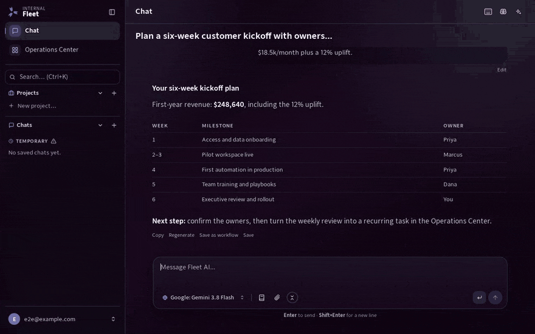
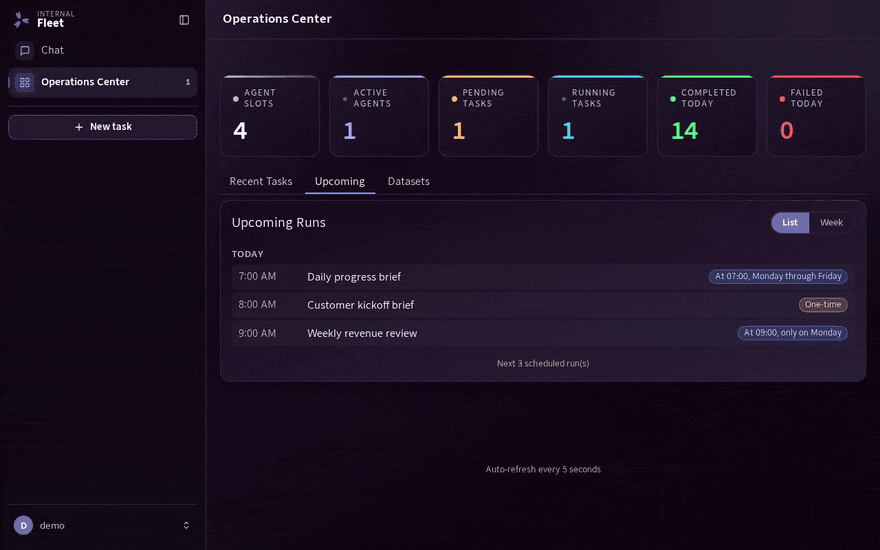
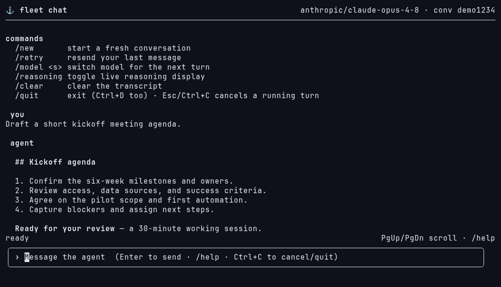
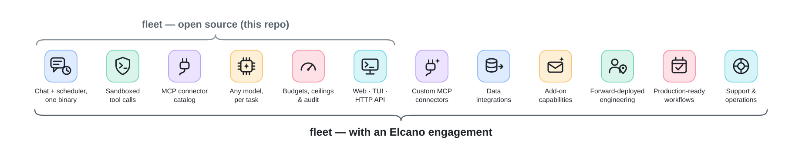

# fleet

**A general-purpose agent fleet you run yourself — any model, in a
sandbox, on a budget, connected to your data.**

fleet is how a whole department adopts AI agents without losing sleep: local
execution sandboxed, every turn metered against a budget, every credential held
server-side, and every working setup versioned so it runs again tomorrow — for
the next person, on a schedule. MIT-licensed, on your infrastructure: your
compute, your data, your know-how. You own the means of production.

## See it in action

One story, three surfaces: **plan the work in chat, automate the
follow-through, ride along from anywhere.** These show the current web app and
terminal client with scripted example data; no live model is used. Each
screenshot is its recording's final frame; tap it to watch ([how they're made](docs/generating-demo-gif.md)).

<!-- Keep the GIFs linked, not inlined: the GitHub mobile app re-renders the
     whole README on every GIF frame, so inline recordings make the page flicker
     nonstop (github.com/orgs/community/discussions/50309). -->

**Chat — plan the kickoff** _(scripted example)_

[](docs/screenshots/web/chat-demo.gif)

▶ [Watch the chat recording](docs/screenshots/web/chat-demo.gif)

**Operations Center — the follow-through, automated** _(example tasks)_

[](docs/screenshots/web/ops-demo.gif)

▶ [Watch the Operations Center recording](docs/screenshots/web/ops-demo.gif)

**Terminal chat (`fleet chat`) — the same fleet, from your shell**

[](docs/screenshots/tui/demo.gif)

▶ [Watch the terminal recording](docs/screenshots/tui/demo.gif)

More: [screenshots of every surface](docs/screenshots/).

## Contents

- [See it in action](#see-it-in-action) · [Why fleet](#why-fleet) · [Batteries included](#batteries-included) · [Built for trust](#built-for-trust-governed-auditable-delegation) · [Architecture at a glance](#architecture-at-a-glance) · [Standards](#standards)
- [The client-config bundle](#the-client-config-bundle-your-agent-ip-is-portable) · [Development](#development) · [Deploy](#deploy) · [Operating fleet](#operating-fleet) · [Documentation](#documentation)
- [Built by Elcano](#built-by-elcano-commercial-support) · [Contributing](#contributing) · [Acknowledgements](#acknowledgements) · [License](#license)

## Why fleet

If your team keeps reaching for the same agent recipes — the same prompts, the
same connected tools, the same guardrails — fleet is the place to standardize
them.

- **Any model.** fleet runs its own native agent loop and lets you choose the
  **best model for each task** rather than hard-wiring one vendor. You decide,
  **at the model layer**, who sees your data — task by task, and you can
  change your mind tomorrow.

- **Sandboxed by default.** Model-authored local execution — bash, Python, and
  file I/O — runs in a sandbox: rootless Podman by default, or an ephemeral
  Kubernetes pod. There is **no fast path around it**. MCP calls are a
  documented host-side broker exception, run by a dedicated broker subprocess,
  so their credentials never enter the sandbox or model context
  ([ADR-0040](docs/adr/0040-child-owned-remote-mcp-runtime.md)).

- **Two isolation tiers, one config line.** Set `sandbox.runtime: kata` (or
  `libkrun`) and every sandbox container becomes a **dedicated KVM microVM**
  (one per turn / scheduled run / persistent-REPL conversation) — escape now
  takes a hypervisor CVE, not a container break-out; fail-closed preflight at
  boot. [`docs/SANDBOX-RUNTIMES.md`](docs/SANDBOX-RUNTIMES.md).

- **Cost-controlled.** Per-turn cost and token **ceilings**, an iteration cap,
  and a timeout — enforced, not advisory. A runaway loop costs a capped turn,
  not an open-ended invoice.

- **Connected to your data.** fleet speaks [MCP](#standards): a per-deployment
  connector catalog with multi-account credentials brokered host-side, per-task
  tool selection, and per-user hosted-MCP connections.

- **Your setups, packaged.** Personas, playbooks, skills, connectors, branding,
  and model defaults live in a versioned **client-config bundle** (see below) —
  standardize once, reuse everywhere.

- **MIT-licensed and observable.** Structured observer events for every turn —
  each tool call, result, token count, and cost — so you always know what an
  agent did and what it cost.

## Batteries included

fleet ships usable on day one — the platform pieces you'd otherwise assemble
yourself are already in the box, tested, and governed by the same core:

- **An MCP connector library, two trust classes deep.** Your bundle's own
  connectors run as fixed host-side broker operations (not model-authored
  sandbox code), and a
  curated directory of **hundreds of verified vendor-hosted MCP servers**
  (GitHub, Google, Notion, Slack, Stripe, X, OpenRouter, Hugging Face, AWS, …)
  is one OAuth click away — each explicitly badged *Bundled* vs *Third-party*
  so users know what they're opting into ([`docs/MCP-CATALOG.md`](docs/MCP-CATALOG.md)).
  Inline `http_tools` cover the "just call this REST endpoint" cases without an
  MCP subprocess.
- **A real scheduler, not a cron wrapper.** Priority queues with
  anti-starvation, transient-only retries with backoff, SLA tracking, dead-letter
  + replay, per-task sandbox limits, structured JSON output (`output_schema`),
  live SSE run streams, batch/import/export, and an Upcoming-runs view. Every
  knob and default: [`docs/FEATURE-NOTES.md`](docs/FEATURE-NOTES.md).
- **Automation surface for your own ecosystem.** Typed API keys + an
  OpenAPI-specified HTTP API to enqueue and consume governed agent jobs from CI,
  cron, bots, or other tasks ([`docs/BUILDING-ON-FLEET.md`](docs/BUILDING-ON-FLEET.md));
  inbound HMAC webhooks and email triggers to spawn work; outbound
  signed-webhook/email/browser-push notifications when it finishes.
- **Memory that can be trusted.** Typed, provenanced user memory with
  approval-gated writes, pin/retire lifecycle, human-confirmed supersession,
  and a derived temporal knowledge graph with as-of queries
  ([`docs/MEMORY.md`](docs/MEMORY.md)).
- **Team surfaces.** Projects/spaces with shared instructions + curated
  connectors + shared memory, team RBAC, read-only share links, conversation
  branching, conversation labels, and a dataset/table agent for row-by-row
  background work with human-approved write-backs.
- **Quality gates for your agents.** A self-hosted eval & regression harness
  (`fleet eval`) that replays golden prompts through the real loop and gates
  model/bundle changes ([`docs/EVALS.md`](docs/EVALS.md)); per-run error
  analysis; optional PII redaction.
- **Three clients out of the box.** The web chat UI, the Operations Center,
  and a full terminal client (`fleet chat`) — all thin views over the same
  governed API.

## Built for trust: governed, auditable delegation

The hard part of agent adoption isn't technical anymore — the real barriers
are human: *does it work, can I trust it, and am I willing to hand over
control?* fleet earns each yes with engineering, not promises: sandboxes,
budgets, approvals, and receipts.

**Can it do the job — reproducibly?** The whole agent setup — prompts,
personas, playbooks, skills, connectors, model defaults — is a **versioned
bundle** (a plain git repo), so the setup that worked runs again next time, for
the next person, on a schedule. Every turn streams structured **observer
events** (each tool call, result, tokens, cost), so you judge work from its
trace, not just its final answer.

**Should I trust it with this task?** Limits that actually fire — cost ceiling,
token ceiling, iteration cap, timeout — and a persisted per-turn audit trail.
fleet owns execution end to end: there is no self-executing agent it can only
observe, so the log records what actually ran.

**Am I comfortable handing over control?** The agent has no direct power: every
model-authored local tool call goes through the sandbox under host policy
(optionally a KVM microVM), credentials stay host-side, sensitive actions raise a
**default-deny allow/deny card** with no "approve all", and unattended scheduled
work is fail-closed — network-sealed by default with an end-of-run verifier
([`docs/AGENT-RUNTIME.md`](docs/AGENT-RUNTIME.md)). The out-of-process MCP
address-space boundary is active for bundle MCP servers, inline HTTP tools, and
per-run hosted MCP clients. Explicit remote-MCP OAuth/connectors HTTP endpoints
remain parent-side control-plane code
([ADR-0040](docs/adr/0040-child-owned-remote-mcp-runtime.md)). One caveat to respect: the
bundle's own host-side MCP servers *do* receive brokered credentials by design,
so treat bundle write access as production access
([`SECURITY.md`](SECURITY.md)).

## Architecture at a glance

A single `fleet` process runs **interactive real-time chat** (streamed over
SSE) and a **scheduling engine** for recurring background agent tasks — both
driven by **one** unified agent runtime (`internal/agentcore`), and both
executing their tool calls in the **same** sandbox: rootless Podman on the box
by default, or ephemeral pods under `FLEET_SANDBOX_BACKEND=kubernetes`
([ADR-0049](docs/adr/0049-kubernetes-backend-split-control-plane.md)).

## Standards

fleet is built on open protocols:

- **[MCP](https://modelcontextprotocol.io)** — the connector catalog (stdio +
  HTTP), plus per-user OAuth into hosted MCP servers
  ([ADR-0009](docs/adr/0009-per-user-remote-mcp-oauth.md)).
- **[Agent Skills](https://github.com/anthropics/skills)** and
  **[Agent Plugins](https://agent-plugins.org)** — packaged capabilities loaded
  from the bundle's `skills/` and `plugins/`
  ([`docs/AGENT-PLUGINS.md`](docs/AGENT-PLUGINS.md)).
- **[A2A](https://a2a-protocol.org)** — call fleet as an agent, or delegate
  out to remote A2A agents ([`docs/A2A.md`](docs/A2A.md)).
- **[ACP](https://agentclientprotocol.com)** — `fleet acp` lets ACP clients
  (Buzz, Zed, JetBrains) drive governed fleet turns ([`docs/ACP.md`](docs/ACP.md)).
- **OpenAPI 3.1** — the HTTP API contract
  ([`docs/openapi.yaml`](docs/openapi.yaml)), kept in lockstep with the router
  by a CI drift test.

## The client-config bundle: your agent IP is portable

fleet ships **no** client-specific content. Everything that defines how your
agents behave lives in a **client-config bundle** — a plain git repo or
directory you own (`FLEET_CLIENT_CONFIG_DIR`), not inside fleet's database or
binary:

- **`manifest.yaml`** — branding, model defaults, the MCP catalog, tool policy, sandbox block
- **`system_prompts/`**, **`personas/`**, **`protocols/`** — base prompts, agent profiles, playbooks
- **`skills/`** and **`plugins/`** — [Agent Skills and Agent Plugins](#standards)
- **`mcp/`** — your MCP connectors (+ `requirements.txt`)
- **`sandbox/Containerfile`** — the exact image your tool calls run in

These files encode how your business actually works, so owning them outright
matters. Versioned and over open protocols, your setup travels with you — fork
it per team, share it across orgs, or point it at another MCP-capable platform.
Contract: [`config/default/README.md`](config/default/README.md).

Three ways in: **run bare** (the in-repo generic bundle — good for a first
look), **fork a public template**
([`example-config`](https://github.com/ElcanoTek/example-config) for a single
box, [`example-kubernetes-config`](https://github.com/ElcanoTek/example-kubernetes-config)
for a cluster — peers, not parent and child), or **point at your own private
repo** (the box needs a read-only fine-grained PAT to clone it).
`bootstrap --client-config <git-url[#sha-or-tag]|path>` sets it up; **pin the
ref in production** — the bundle runs host-side under the service identity
([`SECURITY.md`](SECURITY.md)), so a bundle change should be a deliberate
operator action, not a silent pull.

## Development

```
make build      # compile-check ./... and emit ./fleet
make test       # the tagged Go test suite
make lint       # golangci-lint, ruff, migration + workflow/shell lint
make ci-local   # the fast PR gates (Go + web), locally
```

For the full build/test workflow (the Postgres-backed Go suites, the web app,
the Playwright e2e suites) and a map of the tree, see [`AGENTS.md`](AGENTS.md);
[`ONBOARDING.md`](ONBOARDING.md) covers the clone-to-first-turn path.

### Running one task locally (`fleet task run`)

`fleet task run` executes a **single task YAML** to completion locally — no
server, no database — through the **same governed runtime** the production
scheduler uses (sandbox and credential brokering included). A debug
entrypoint, not a second execution path.

```
fleet task run --log out.json path/to/task.yaml               # run one task through the governed runtime
scripts/run_workflow_live.sh docs/examples/local-task.yaml    # or: build the sandbox image, isolate a workspace, tail a log
```

See [`docs/examples/local-task.yaml`](docs/examples/local-task.yaml) for the
task schema (a thin mirror of the scheduled-task create shape).

## Deploy

fleet runs as **one** `fleet` process on a **single, vertically-scaled host**: the
browser talks only to the Next.js web app, which proxies server-side over
loopback to the two Go backends the process boots (chat + orchestrator); Caddy
fronts it with TLS and routes the public `/v1` API (plus `/api-info`, the A2A
agent card, `/triggers/*` and `/webhooks/*`) straight to those backends. Single-host is by design — crash recovery uses single-owner
DB leases and the worker cap is a per-process semaphore, so fleet scales by
moving to a bigger box, not more replicas.

On a fresh Fedora box, one line — it clones `main` into `/opt/fleet/src` and
runs the interactive bootstrap (service, web UI + TLS domain, OpenRouter key,
SSO key, admins):

```sh
curl -fsSL https://raw.githubusercontent.com/ElcanoTek/fleet/main/install.sh | sudo bash
```

Unattended, pass bootstrap flags through:

```sh
curl -fsSL https://raw.githubusercontent.com/ElcanoTek/fleet/main/install.sh | sudo bash -s -- \
  --postgres=local --enable-web --domain fleet.example.com \
  --client-config https://github.com/ElcanoTek/example-config.git
```

For automation, download first so a failed fetch is a failed step (a pipe into
`bash` exits 0 on an empty download), and feed stdin from `/dev/null` so a TTY-allocating
runner can't leave bootstrap waiting on a prompt:

```sh
curl -fsSLo /tmp/fleet-install.sh https://raw.githubusercontent.com/ElcanoTek/fleet/main/install.sh \
  && sudo bash /tmp/fleet-install.sh --postgres=local --enable-service --client-config <bundle> </dev/null
```

Then `fleet status`, `sudo fleet doctor`, and `sudo fleet update` from there on
(the checkout and installed binaries are root-owned). Design note: [`docs/INSTALLER.md`](docs/INSTALLER.md).

**→ Full deployment guide** — host sizing, the one-command web + Caddy/TLS stack,
the env file, and every option: **[`docs/DEPLOYMENT.md`](docs/DEPLOYMENT.md)**.

**Kubernetes shop?** fleet also ships a first-class cluster path
([ADR-0049](docs/adr/0049-kubernetes-backend-split-control-plane.md)): a Helm
chart (`deploy/helm/fleet`) for the single-replica control plane, with agent
sandboxes running as **ephemeral pods** via
`FLEET_SANDBOX_BACKEND=kubernetes` — same loop, same security model, one
backend switch. See
**[`docs/DEPLOYMENT-KUBERNETES.md`](docs/DEPLOYMENT-KUBERNETES.md)**.

## Operating fleet

The operator lifecycle is **bootstrap → update → status**, one box. The server
runs via `fleet serve`; every other verb is the idempotent operator CLI (each a
`scripts/` shell script wrapped by a `fleet` subcommand). Each service
self-migrates on start.

| Verb | What it does |
|---|---|
| `fleet bootstrap` | provision a box (Postgres, build, install, systemd, optional web + TLS) |
| `fleet update` | `git pull` + rebuild + reinstall the binaries in place |
| `scripts/fleet-upgrade.sh` | drain, swap, health-gate, and auto-roll-back on failure |
| `fleet status` / `fleet diagnose` | quick health report / redacted support bundle |
| `fleet doctor` | diagnose **and repair** box-level drift (packages, podman prereqs, unit drift; also surfaced read-only in Settings → Admin → Doctor) |
| `fleet restart` · `stop` · `logs` | service lifecycle |
| `fleet chat [--email you@org]` | terminal TUI for the agent (token auto-read on-box) |
| `fleet backup` / `fleet restore` | disaster recovery ([`docs/BACKUP_RESTORE.md`](docs/BACKUP_RESTORE.md)) |
| `fleet timers install` | install + enable the daily backup/maintenance systemd timers on an existing box ([`docs/TIMERS.md`](docs/TIMERS.md)) |
| `fleet version` | the build identity — date-based release + revision, e.g. `2026.09.04.2 (a1b2c3d4e5f6)` ([`docs/VERSIONING.md`](docs/VERSIONING.md)) |

**→ Full operator runbook** — the env file, the client-config checkout, every
verb in detail, process logs, and backup/restore:
**[`docs/OPERATORS.md`](docs/OPERATORS.md)**.

## Documentation

Deep references live in [`docs/`](docs/) so this README stays an orientation, not a manual:

| Doc | What it covers |
|---|---|
| [`docs/DEPLOYMENT.md`](docs/DEPLOYMENT.md) | Full deployment guide — host sizing, the one-command web + Caddy/TLS stack, options |
| [`docs/VERSIONING.md`](docs/VERSIONING.md) | Releases: date-based (`vYYYY.MM.DD.N`), tagged automatically on every green push to `main`, nobody types a version |
| [`docs/DEPLOYMENT-KUBERNETES.md`](docs/DEPLOYMENT-KUBERNETES.md) | Kubernetes as a first-class path — the Helm chart, the `kubernetes` sandbox backend (agent sandboxes as ephemeral pods), kind walkthrough + production checklist |
| [`docs/OPERATORS.md`](docs/OPERATORS.md) | Operator runbook — the env file, the client-config checkout, every lifecycle verb |
| [`docs/AGENT-RUNTIME.md`](docs/AGENT-RUNTIME.md) | Agent runtime mechanics — per-turn sandbox, ceilings, compaction, verifier, artifacts |
| [`docs/SANDBOX-RUNTIMES.md`](docs/SANDBOX-RUNTIMES.md) | Sandbox OCI runtimes — `runc` / Kata / libkrun isolation tiers |
| [`docs/BACKUP_RESTORE.md`](docs/BACKUP_RESTORE.md) | Disaster recovery — backup + restore of both databases |
| [`docs/WEBHOOK-SIGNING.md`](docs/WEBHOOK-SIGNING.md) · [`docs/TESTING.md`](docs/TESTING.md) | Webhook HMAC signing · the test suite + fake-LLM seam |
| [`docs/SCANNING.md`](docs/SCANNING.md) | The scanning stack — which scanner owns what, and what actually blocks a merge |
| [`docs/BUILDING-ON-FLEET.md`](docs/BUILDING-ON-FLEET.md) | The HTTP API as an automation substrate — keys, kicking off jobs, consuming structured output |
| [`docs/MCP-CATALOG.md`](docs/MCP-CATALOG.md) | The connector catalog — bundled vs third-party trust classes |
| [`docs/README.md`](docs/README.md) | The full documentation index — every design note, runbook and ADR, by question |
| [`docs/adr/`](docs/adr/) | Architecture Decision Records — the *why* behind the non-negotiable invariants |
| [`SECURITY.md`](SECURITY.md) · [`CONTRIBUTING.md`](CONTRIBUTING.md) | Reporting a vulnerability · contributor workflow + CI gates |

## Built by Elcano (commercial support)

fleet is built by **ElcanoTek**. Everything in this repository is the complete,
MIT-licensed platform — there is no held-back enterprise edition. What an
**Elcano engagement** adds is the team that built it, working inside your stack:

<picture>
  <source media="(prefers-color-scheme: dark)" srcset="docs/img/open-source-vs-elcano-dark.svg">
  
</picture>

- **Forward-deployed engineering.** Elcano engineers embed with your team, take
  the workflows your people already run in chat, and make them
  production-ready: scheduled, monitored, budgeted, and verified.
- **Custom MCP connectors & data integrations.** Bespoke connectors into the
  systems your work actually lives in — built, credential-brokered, and
  maintained for your deployment.
- **Add-on capabilities.** Agents and services Elcano builds and operates
  beyond this repo — email-native agents, monitoring and analysis tools, and
  other domain-specific pieces, packaged into your client-config bundle.
- **Deployment, support & operations.** fleets stood up on your infrastructure
  and kept healthy — upgrades, sandbox images, and model changes gated by evals
  before they ship.

Engagements don't shrink the repo: client-specific work lives in each client's
config bundle, and platform improvements land here, in the open.

[elcanotek.com](https://elcanotek.com) ·
[hello@elcanotek.com](mailto:hello@elcanotek.com)

## Contributing

Contributions are welcome — see [`CONTRIBUTING.md`](CONTRIBUTING.md) for the
build/test workflow, branch/PR conventions, and CI gates. Please also read the
[`CODE_OF_CONDUCT.md`](CODE_OF_CONDUCT.md). To report a security issue privately,
see [`SECURITY.md`](SECURITY.md).

## Acknowledgements

fleet stands on the shoulders of excellent open-source projects and open
standards. Our thanks to the teams and communities behind them:

- **[Podman](https://github.com/containers/podman)** — rootless, daemonless
  containers — the default sandbox backend every model-authored `bash`,
  `run_python`, and file-I/O call executes in.
- **[Kata Containers](https://katacontainers.io)** and
  **[libkrun](https://github.com/containers/libkrun)** — the OCI runtimes behind
  fleet's optional hypervisor-isolation tier: set `sandbox.runtime` and every
  sandbox container becomes a dedicated KVM microVM with its own guest kernel,
  plugging into the same Podman invocation unchanged.
- **[Fedora](https://fedoraproject.org)** — `fedora-minimal` is the base image
  for the default sandbox, and we think it's the safest base in the game for
  this job: a deliberately small image (less surface to attack), backed by one
  of the fastest CVE-response pipelines in any distribution, with the entire
  Python data stack installed as **signed Fedora RPMs** instead of `pip` at
  runtime — one audited supply chain, not a thousand PyPI tarballs. fleet tracks
  the rolling tag so every on-box rebuild picks up current patches, and Grype
  scans keep the claim honest.
- **[Model Context Protocol](https://modelcontextprotocol.io)**,
  **[Agent Skills](https://github.com/anthropics/skills)**, and
  **[Agent Plugins](https://agent-plugins.org)** — the open standards for tools,
  packaged capabilities, and the portable bundles that carry them. fleet speaks
  MCP (stdio + HTTP) through a credential-brokered catalog and loads skills and
  plugins straight from the client-config bundle.
- **[A2A](https://a2a-protocol.org)** and
  **[ACP](https://agentclientprotocol.com)** — the open agent-to-agent and
  agent-client specs fleet uses to talk with other agents and with the clients
  people already work in.
- **[Charmbracelet](https://github.com/charmbracelet)** — fleet leans on the
  charm stack end to end: **[Fantasy](https://github.com/charmbracelet/fantasy)**
  is the Go framework underneath the multi-provider agent run loop, and the
  `fleet chat` terminal client is built on
  **[Bubble Tea](https://github.com/charmbracelet/bubbletea)**,
  **[Bubbles](https://github.com/charmbracelet/bubbles)**,
  **[Lip Gloss](https://github.com/charmbracelet/lipgloss)**, and
  **[Glamour](https://github.com/charmbracelet/glamour)** — with
  **[vhs](https://github.com/charmbracelet/vhs)** recording the README's TUI
  demo and **[freeze](https://github.com/charmbracelet/freeze)** rendering its
  static screenshots.
- **[OpenRouter](https://openrouter.ai)** — unified, provider-agnostic model
  routing that backs fleet's "any model, the right one per task" design.

## License

fleet is released under the [MIT License](LICENSE).
